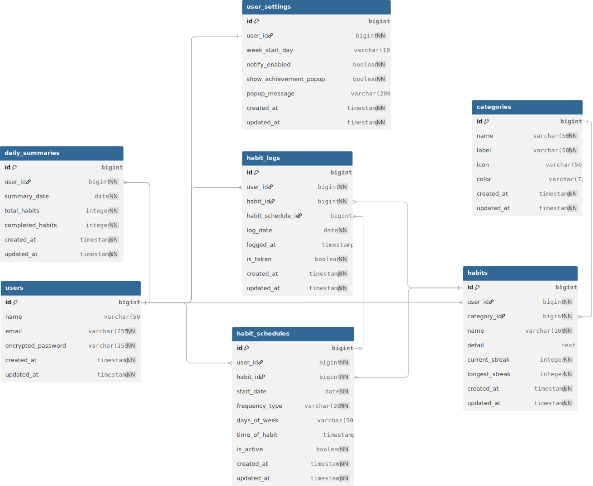

# プロジェクト名：『haby』

# 目次

- [サービス概要](#サービス概要)
- [サービスURL](#サービスurl)
- [サービス開発の背景](#サービス開発の背景)
- [機能紹介](#機能紹介)
- [技術構成について](#技術構成について)
  - [使用技術](#使用技術)
  - [ER図](#er図)
  - [画面遷移図](#画面遷移図)

# サービス概要

〜 毎日の服薬・サプリ習慣を、無理なく続けるための記録サービス 〜

『haby』は、薬やサプリメントの飲み忘れを防ぎたい人のための服薬・サプリ習慣化支援アプリです。

日々の服薬・サプリ摂取をワンタップで記録し、カレンダー上で達成状況を可視化することで、「今日できた」という小さな成功体験を積み重ねられるサービスとなっています。

服薬管理アプリにありがちな堅さや入力の多さを減らし、忙しい日でも続けやすいシンプルな操作性と、やさしいデザインを意識して開発しました。

# サービスURL

### https://yourhaby.com

# サービス開発の背景

私自身、健康のためにサプリメントを飲むようにしていましたが、仕事が忙しい時期や体調が悪い時など、気づけば数日飲み忘れてしまうことがありました。

「健康のために続けたい」という気持ちはあるのに、日常の中でつい忘れてしまう。

このような小さな飲み忘れが積み重なることで、せっかく始めた健康習慣が続かなくなってしまうことに課題を感じました。

また、周囲でも「薬を飲み忘れてしまう」「サプリを買ったけれど続かない」といった声を聞くことがありました。

そこで私は、服薬やサプリ摂取を根性で続けるのではなく、記録のしやすさ・達成感・可視化によって自然と続けられるアプリを作りたいと考えました。

habyでは、以下のような課題を解決することを目指しています。

- 薬やサプリを飲んだかどうか忘れてしまう
- 記録が面倒で習慣化アプリ自体が続かない
- 継続状況が見えず、モチベーションが下がってしまう
- 医療系アプリは多機能すぎて、日常使いには少し重く感じる

これらの課題を補うために、「ワンタップで記録できること」「カレンダーで継続状況が見えること」「やさしいUIで毎日使いやすいこと」を重視して開発しました。

# 機能紹介

## トップページ

  

トップページでは、habyのサービス概要や主な機能を紹介しています。  
服薬・サプリ習慣を記録できること、カレンダーで継続状況を確認できること、ワンタップで手軽に使えることが伝わるように構成しました。

また、未ログインのユーザーがサービス内容を理解したうえで利用を開始できるよう、新規登録・ログインへの導線を設置しています。

服薬管理というテーマが堅くなりすぎないよう、やさしい色合いとシンプルなレイアウトを意識し、初めて訪れたユーザーにも安心感を持ってもらえるデザインを目指しました。

---

## ユーザー登録 / ログイン

  

メールアドレスとパスワードを入力してユーザー登録・ログインを行うことができます。  
認証機能にはDeviseを使用しており、ログイン後は自分専用の習慣データを管理できます。

また、Googleアカウントを用いたログイン機能にも対応しています。

---

## 習慣登録機能

  

薬やサプリメントなど、毎日続けたい健康習慣を登録できます。  
登録時には、習慣名や詳細を入力することができ、自分が管理したい服薬・サプリ習慣をアプリ内に保存できます。

登録した習慣は、一覧画面から確認・編集・削除することができます。

---

## 今日の習慣記録機能

  

今日実施する習慣を一覧で確認し、ワンタップで「実施済み」に切り替えることができます。  
毎日の記録操作をできるだけ簡単にすることで、忙しい日でも負担なく記録を続けられるようにしています。

すべての習慣を達成した際には、達成メッセージを表示し、ユーザーが小さな達成感を得られるようにしています。

---

## カレンダー機能

  

日々の服薬・サプリ記録をカレンダー形式で確認できます。  
記録状況を日付ごとに可視化することで、どの日に達成できたか、どのくらい継続できているかを一目で把握できます。

カレンダー上では、達成状況に応じて表示を変えることで、継続のモチベーションにつながるようにしています。

---

## マイページ機能

  

ユーザー情報の確認や、アカウント情報の編集を行うことができます。  
サービスを継続して利用する中で、ユーザー自身の情報を管理できるようにしています。

---

## お問い合わせ機能

  

アプリに関する問い合わせを送信できるフォームを実装しています。  
ユーザーからの意見や不具合報告を受け取れるようにし、サービス改善につなげられる構成にしています。

# 技術構成について

## 使用技術

| カテゴリ | 技術内容 |
| --- | --- |
| サーバーサイド | Ruby on Rails 7.2.3 |
| 言語 | Ruby 3.3.6 / JavaScript |
| フロントエンド | HTML / CSS / JavaScript |
| CSS・デザイン | CSS / Figma |
| 認証 | Devise / devise-i18n |
| 外部認証 | Google OAuth |
| カレンダー | simple_calendar |
| データベース | PostgreSQL |
| メール確認・開発補助 | letter_opener_web |
| テスト | RSpec / FactoryBot / Capybara / Selenium |
| 静的解析 | RuboCop / Brakeman |
| 開発環境 | Docker / Docker Compose |
| デプロイ | Render |
| バージョン管理 | Git / GitHub |

## ER図

## 画面遷移図

Figma：

https://www.figma.com/design/eX0dReaBQAc6FFHpekVgYD/haby?node-id=0-1&p=f&t=wHlaf41nctMMZpQ8-0

# 今後の展望

今後は、より服薬・サプリ習慣を続けやすくするために、以下の機能を追加・改善していく予定です。

- プッシュ通知・リマインダー機能
- 服薬率・継続日数の自動集計
- 週・月単位のグラフ表示
- 習慣達成時のアニメーション強化
- スマートフォンでの操作性改善
- UI/UXのさらなる改善

# こだわったポイント

## 1. ワンタップで記録できるシンプルな操作性

服薬やサプリの記録は、操作が面倒だと続かなくなってしまうと考えました。

そのため、habyでは「今日飲んだかどうか」をできるだけ少ない操作で記録できるように設計しています。

## 2. 継続状況をカレンダーで可視化

ただ記録するだけでなく、カレンダーで過去の達成状況を見返せるようにしました。

自分がどれだけ続けられているかを視覚的に確認できることで、継続のモチベーションにつながるようにしています。

## 3. 医療アプリらしすぎない、やさしいデザイン

服薬管理というテーマは堅い印象になりやすいため、habyでは日常生活に馴染むやさしい色合いとシンプルなUIを意識しました。

「管理されている感」よりも、「今日も少しできた」と思える体験を大切にしています。

## 4. 失敗しても続けやすい設計

習慣化では、1日できなかっただけでやる気が下がってしまうことがあります。

habyでは、連続記録だけを重視するのではなく、長期的に見て少しずつ続けられることを大切にしています。
